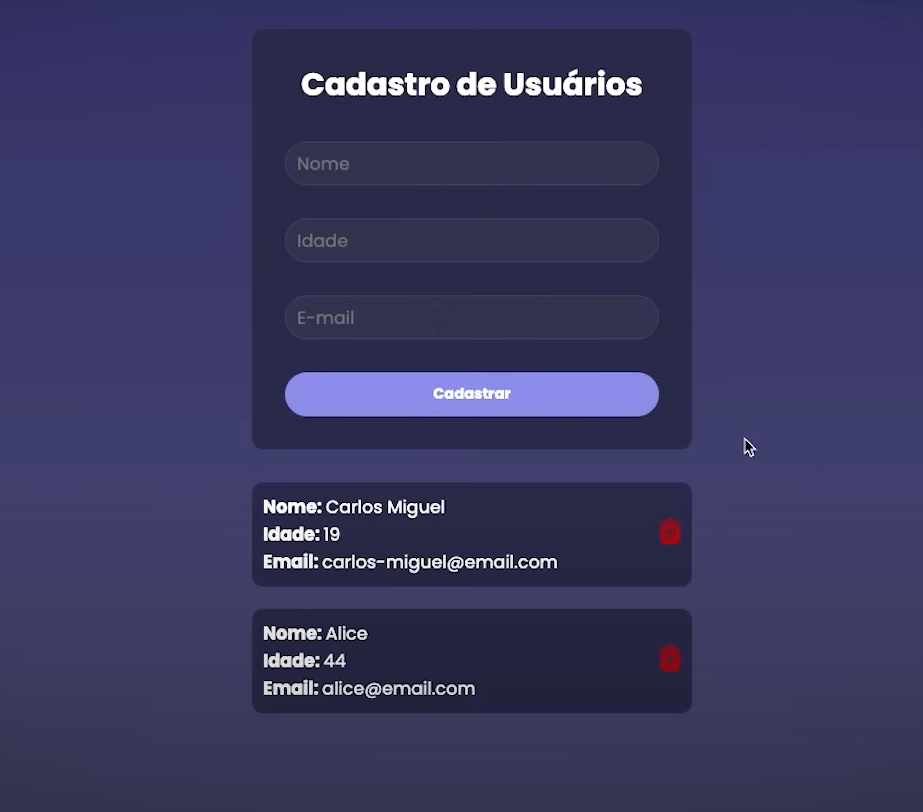

🚀 API RESTful com Node.js + React 

Esta **API RESTful** foi desenvolvida utilizando **Node.js**, **React**, **Axios** e **Prisma**, proporcionando uma estrutura modular, escalável e eficiente.  
O objetivo principal é **gerenciar usuários e produtos**, garantindo segurança e desempenho otimizado.  

## 🛠️ Tecnologias Utilizadas  

### 🔹 Backend  
  
  
  
  

### 🔹 Frontend  
  
  
  

---

🔥 Endpoints da API

➤ 🧑‍💼 Usuários
📌 GET /users → Retorna todos os usuários
📌 POST /users → Cria um novo usuário
📌 PUT /users/:id → Atualiza um usuário
📌 DELETE /users/:id → Remove um usuário

🤝 Como Contribuir

Contribuições são bem-vindas! Para contribuir:

1️⃣ Faça um fork do projeto
2️⃣ Crie uma nova branch (git checkout -b feature-minha-feature)
3️⃣ Commit suas alterações (git commit -m 'Adiciona minha nova feature')
4️⃣ Faça um push para a branch (git push origin feature-minha-feature)
5️⃣ Abra um Pull Request

